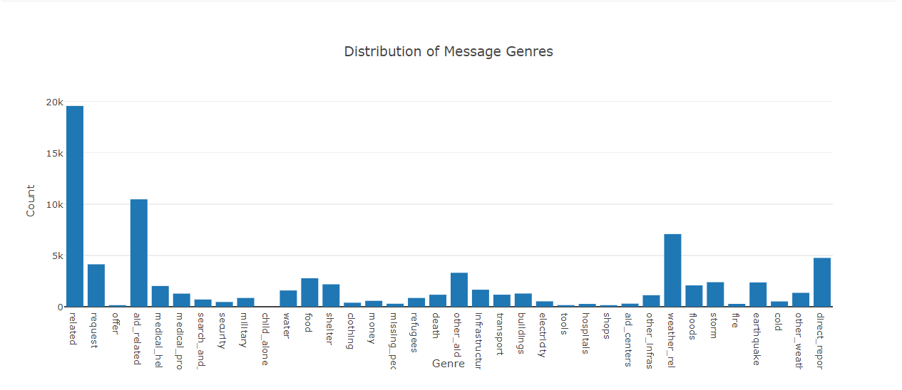
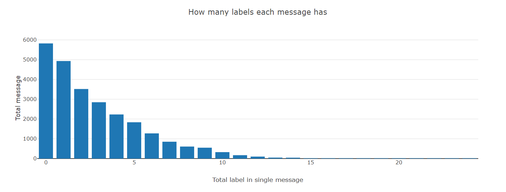
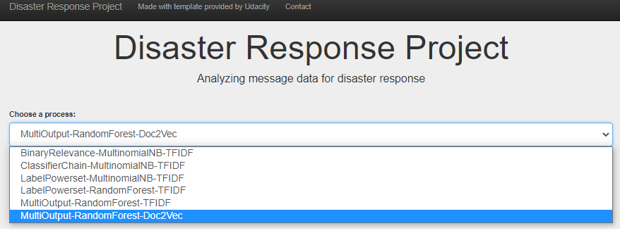
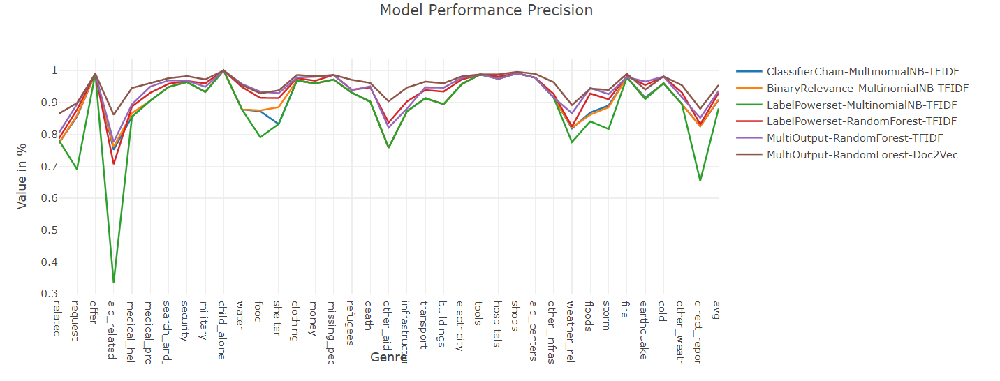
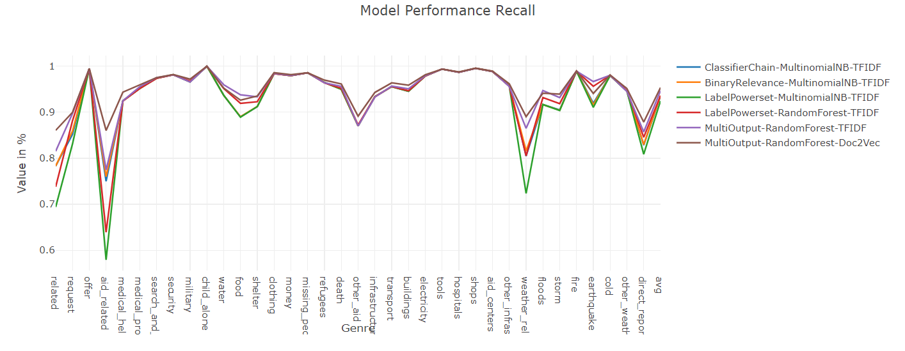
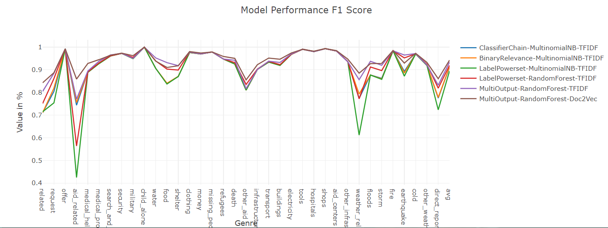
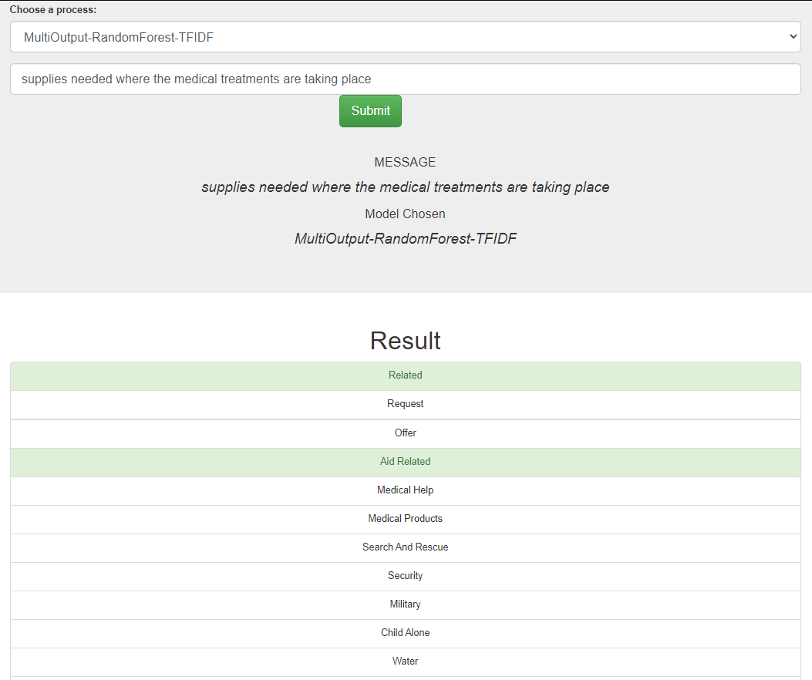
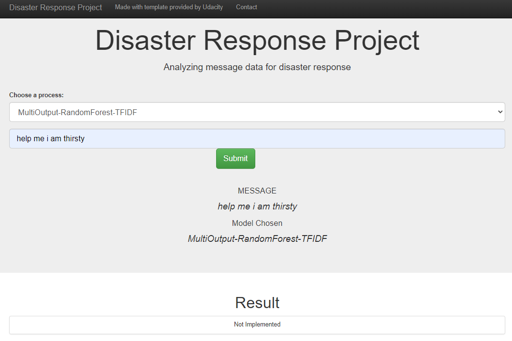

# Disaster Response Pipeline Project

### Instructions:
1. Run the following commands in the project's root directory to set up your database and model.

    - To run ETL pipeline that cleans data and stores in database
        `python data/process_data.py data/disaster_messages.csv data/disaster_categories.csv data/DisasterResponse.db`
    - To run ML pipeline that trains classifier and saves given database to train the model on and model type (saves the trained model by its type name)
        `python models/train_classifier.py data/DisasterResponse.db <MODEL_TYPE_OPTIONAL>`
    - Possible options for model are as follows (NOTE: if you do not provide a model_type, then it defaults to BinaryRelevance-MultinomialNB-TFIDF as it is the fastest to compute for demonstrations purposes):
        - BinaryRelevance-MultinomialNB-TFIDF
        - ClassifierChain-MultinomialNB-TFIDF
        - LabelPowerset-MultinomialNB-TFIDF
        - LabelPowerset-RandomForest-TFIDF
        - MultiOutput-RandomForest-TFIDF (with grid search)
        - MultiOutput-RandomForest-Doc2Vec (with grid search) (NOTE: best results wrt metrics acquired with this model)

2. Run the following command to run your web app.
    `python app/run.py`

3. Go to http://0.0.0.0:3001/

### Project Explanation

1. Program first takes given `.csv` files, implement necessary wrangling and saves the results to a database. The files contains messages and their labels pre-prepared for supervised multilabel classification learning.
2. Then chosen pipeline with or without the use of `sklearn.model_selection.GridSearchCV` fits the model to splitted
3. Finally present results via Flask app

### Dependencies
- Python 3.10.9
- numpy, scipy, pandas, sklearn, skmultilearn
- nltk
- sqlalchemy
- flask, plotly

### Usage demonstration with pictures

Dataset Visualisation 1

Dataset Visualisation 2

All possible models that can be trained

Precision values comparison between all possible models

Recall values comparison between all possible models

F1 score values comparison between all possible models

An example of query with Binary Relevance Model

When necessary model has not been trained, app states it is not implemented as:
